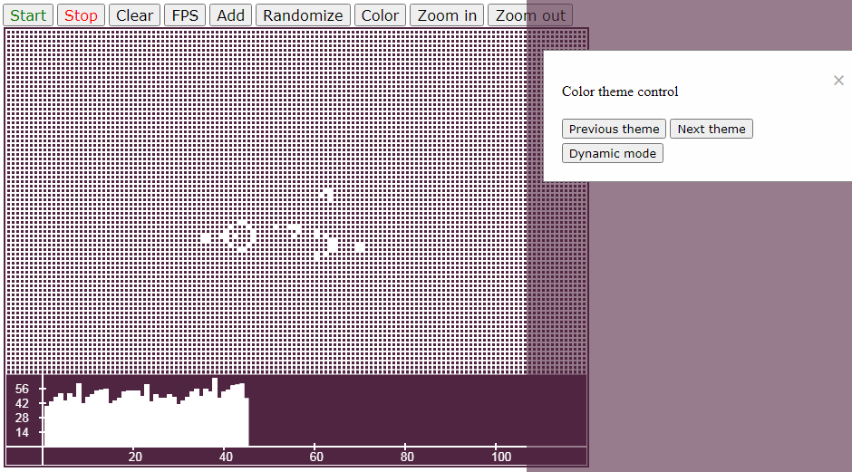

# Life
Simple javascript and HTML5's canvas Conway's Game of Life with visualization of the current population data. The population graph is an updated column plot.   [View online](https://yeryomin1.github.io/Life/).
## Current features
* FPS control
* Random seeding of live cells with adjustable density
* Drawing of live cells with the mouse
* Adding patterns to points with custom coordinates:
  * gliders
  * small exploders
  * Grosper glider guns
  * individual cells
* The population graph (shows the population according to the last 100 generations)
* Customizing the color themes including setting up a dynamic theme
* Zooming
* The viewport moving using WASD
## Screenshots
### General
The game as a whole looks like this.  

### Drawing with the mouse
A live cell is created by clicking the left mouse button.  

### Population graph
The graph update frequency is equal to current game fps, which is equal to the generation refresh rate. The ordinate axis is scaled automatically in accordance with the maximum display level of the population.  

### Dynamic color theme
Dynamic theme mode provides smooth color change.  

### Zooming and WASD
The execution of zooming in, out, and moving the viewport is shown below.  
